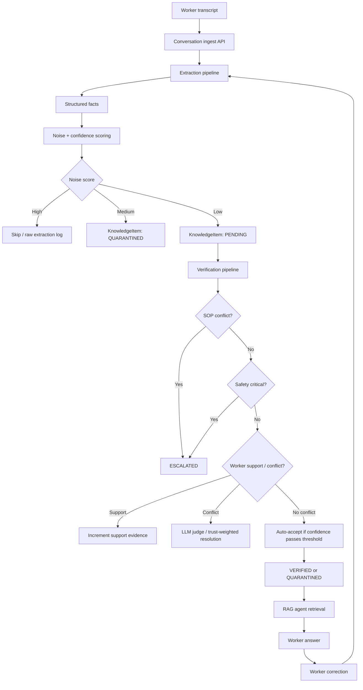

# Minder AI Knowledge Integration System

Minder AI Knowledge Integration System is a FastAPI-based prototype for a factory co-worker agent that can learn **unwritten operational knowledge** from worker conversations.

The project focuses on the hard part of the take-home brief: not just extracting facts from transcripts, but verifying them, reconciling conflicts, preventing knowledge poisoning, serving trusted knowledge back to the agent, and measuring whether the system is actually improving.

## Problem

Factory AI assistants can already retrieve written knowledge such as SOPs, manuals, and policies. The difficult part is **tribal knowledge**:

- A senior welder knows station 3 overheats after lunch on Tuesdays.
- A laundry worker knows Hotel A polyester shrinks if mixed with cotton.
- Workers correct the agent in natural conversation.
- Some statements are true, some are jokes, complaints, guesses, or wrong corrections.

This system turns those conversations into a shared, auditable knowledge base.

## What This Project Does

- Ingests worker transcript text through a FastAPI endpoint.
- Extracts structured operational facts from conversation.
- Scores noise and confidence before accepting knowledge.
- Maintains a knowledge state machine:
  - `PENDING`
  - `VERIFIED`
  - `QUARANTINED`
  - `ESCALATED`
  - `REJECTED`
  - `SUPERSEDED`
- Checks new claims against seeded SOP knowledge.
- Resolves worker-vs-worker support or contradiction.
- Uses SOP-first retrieval policy for agent responses.
- Tracks correction, coverage, acceptance, and utilization metrics.
- Provides a simple dashboard for simulation, knowledge browsing, conflict review, and metrics.
- Supports both offline demo mode and real OpenAI-backed mode.

## Architecture



## Workflow

1. **Conversation Ingestion**
   - `POST /api/v1/conversations/ingest`
   - Creates a conversation record and starts background extraction.

2. **Knowledge Acquisition**
   - Extracts 0-5 concrete operational facts from a transcript.
   - Converts each fact into a structured representation:
     - `entity`
     - `attribute`
     - `value`
     - `unit`
     - `condition`
     - `domain`

3. **Noise and Confidence Scoring**
   - Detects likely jokes, vague claims, low-confidence facts, and ambiguous statements.
   - High-noise facts are skipped.
   - Medium-noise facts are quarantined.
   - Low-noise facts proceed to verification.

4. **Verification and Conflict Resolution**
   - SOP conflict is checked first.
   - SOP is treated as the official source.
   - Safety-critical claims are escalated.
   - Worker-vs-worker contradictions are judged and resolved.
   - Verified items can be used by the agent; quarantined/escalated items cannot.

5. **RAG Agent**
   - Retrieves SOP and `VERIFIED` tribal knowledge.
   - Applies SOP-first policy.
   - If tribal knowledge conflicts with SOP, the agent answers according to SOP and flags the field claim for supervisor review.

6. **Feedback Loop**
   - Worker corrections are captured through:
     - `PATCH /api/v1/agent/{query_log_id}/correct`
   - Corrections reduce trust in served knowledge.
   - The correction text becomes a new conversation input.
   - Metrics update to show whether the system is learning.

## Runtime Modes

The app has two runtime modes.

### Demo Mode

```env
LLM_MODE=demo
```

Demo mode runs fully offline:

- No API key required.
- Uses deterministic demo extraction.
- Uses lexical search instead of vector DB.
- Uses deterministic conflict fallback.
- Best for local testing and reviewing the pipeline behavior.

### OpenAI Mode

```env
LLM_MODE=openai
OPENAI_API_KEY=sk-...
OPENAI_EXTRACTION_MODEL=gpt-4o
OPENAI_JUDGE_MODEL=gpt-4o-mini
OPENAI_CHAT_MODEL=gpt-4o-mini
OPENAI_EMBEDDING_MODEL=text-embedding-3-small
```

OpenAI mode uses real LLM APIs:

- `OpenAIExtractor`: structured output extraction from transcripts.
- `OpenAIConflictJudge`: structured LLM judgment for worker-vs-worker conflicts.
- `OpenAIEmbeddingSearch`: embedding-based retrieval for SOP and verified tribal knowledge.
- `OpenAIAgentGenerator`: SOP-first answer generation for the worker agent.

The deterministic demo components remain in the codebase as test doubles, not as the intended production extraction logic.

## Tech Stack

| Layer | Technology |
|---|---|
| Backend | Python, FastAPI |
| API Server | Uvicorn |
| Schemas | Pydantic |
| LLM | OpenAI Responses API |
| Embeddings | OpenAI `text-embedding-3-small` |
| Demo Store | In-memory Python store |
| Planned Production Store | MySQL + Qdrant |
| Frontend | Vanilla HTML, CSS, JavaScript |
| Tests | Pytest |

## Project Structure

```text
Minder_AI/
├── app/
│   ├── api/v1/              # FastAPI routers
│   ├── core/                # config and in-memory store
│   ├── models/              # domain dataclasses and enums
│   ├── schemas/             # API request/response schemas
│   └── services/            # extraction, verification, vector search, RAG agent
├── docs/                    # implementation plans and brief
├── frontend/                # dashboard UI
├── scripts/                 # seed and simulation scripts
├── tests/                   # pytest demo flow tests
├── docker-compose.yml       # MySQL + Qdrant placeholder infra
├── requirements.txt
└── README.md
```

## API Overview

| Method | Endpoint | Purpose |
|---|---|---|
| `GET` | `/health` | Health check |
| `GET` | `/api/v1/workers` | List demo workers |
| `POST` | `/api/v1/workers` | Create worker |
| `POST` | `/api/v1/conversations/ingest` | Submit transcript for extraction |
| `GET` | `/api/v1/conversations/{id}/status` | Poll extraction status |
| `GET` | `/api/v1/knowledge` | Browse knowledge items |
| `GET` | `/api/v1/knowledge/review` | List items needing review |
| `GET` | `/api/v1/knowledge/conflicts` | View detected conflicts |
| `PATCH` | `/api/v1/knowledge/{id}/resolve` | Supervisor resolve action |
| `POST` | `/api/v1/agent/query` | Ask the agent |
| `PATCH` | `/api/v1/agent/{query_log_id}/correct` | Submit worker correction |
| `GET` | `/api/v1/metrics/dashboard` | Learning metrics |
| `POST` | `/api/v1/admin/seed` | Seed workers and SOP documents |

## Metrics

The dashboard exposes four core learning metrics:

| Metric | Meaning | Direction |
|---|---|---|
| Correction Rate | Fraction of agent answers corrected by workers | Should decrease |
| KB Coverage Score | Fraction of queries using verified tribal knowledge | Should increase |
| Knowledge Acceptance Rate | `verified / (verified + rejected)` | Should be healthy, not blindly high |
| Knowledge Utilization Rate | Fraction of verified items retrieved in the last 7 days | Should increase |

## Quick Start

### 1. Install Dependencies

```bash
python -m pip install -r requirements.txt
```

### 2. Run the App

```bash
python -m uvicorn app.main:app --host 127.0.0.1 --port 8000
```

### 3. Open the App

- Dashboard: [http://127.0.0.1:8000](http://127.0.0.1:8000)
- API docs: [http://127.0.0.1:8000/docs](http://127.0.0.1:8000/docs)

## Docker Compose

Run backend, MySQL, and Qdrant together:

```bash
docker compose up --build
```

Default Docker mode is offline demo mode:

```env
LLM_MODE=demo
```

To run with OpenAI-backed extraction, judge, embeddings, and answer generation, create a local `.env` file:

```env
LLM_MODE=openai
OPENAI_API_KEY=sk-...
```

Then run:

```bash
docker compose up --build
```

Services:

| Service | URL / Port |
|---|---|
| Backend dashboard | `http://127.0.0.1:8000` |
| API docs | `http://127.0.0.1:8000/docs` |
| MySQL | `localhost:3306` |
| Qdrant REST | `http://127.0.0.1:6333` |

## Run Demo Scenario

Start the server, then run:

```bash
python scripts/simulate_conversations.py
```

This script submits several sample conversations and prints the resulting extraction states and metrics.

## Test

```bash
python -m compileall app scripts tests
python -m pytest -q
```

Current expected result:

```text
2 passed
```

## Example Behavior

If a worker says:

```text
The dryer at station 2 should run at 75 degrees Celsius.
```

The seeded SOP says dryer station 2 should run at `78°C`.

Expected behavior:

- The extracted fact becomes a `KnowledgeItem`.
- SOP conflict is detected.
- The item is marked `ESCALATED`.
- It is not used as a primary RAG answer.
- The agent answers according to SOP.

## Current Scope

Implemented:

- End-to-end FastAPI pipeline.
- Dashboard UI.
- Demo workers and SOP seed data.
- LLM adapter interfaces.
- OpenAI extraction, judge, embeddings, and answer-generation paths.
- Offline deterministic fallback for tests.
- Metrics and audit-friendly state transitions.

Not yet implemented as production infrastructure:

- Persistent MySQL storage.
- Real Qdrant vector store persistence.
- Alembic migrations.
- Authentication and role-based supervisor access.
- Durable task queue such as Celery/RQ/Redis.
- Production observability and tracing.

## Design Notes

The code intentionally separates production-oriented adapters from local demo fallback:

- `app/services/llm.py`
  - real OpenAI extractor and conflict judge
  - deterministic conflict fallback
- `app/services/vector.py`
  - OpenAI embedding search
  - lexical fallback
- `app/services/extraction.py`
  - `OpenAIExtractor` in OpenAI mode
  - `DemoExtractor` in demo mode

This keeps the repository runnable without API keys while still showing how the real LLM-backed system should work.

## Repository

GitHub: [https://github.com/Sog1n/Minder-AI](https://github.com/Sog1n/Minder-AI)
